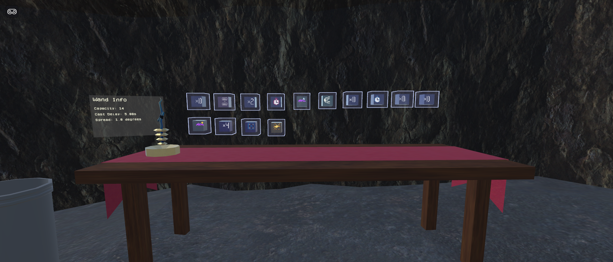
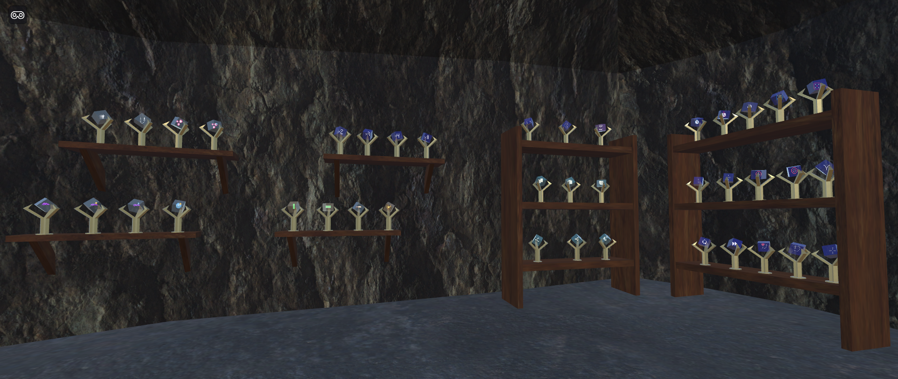
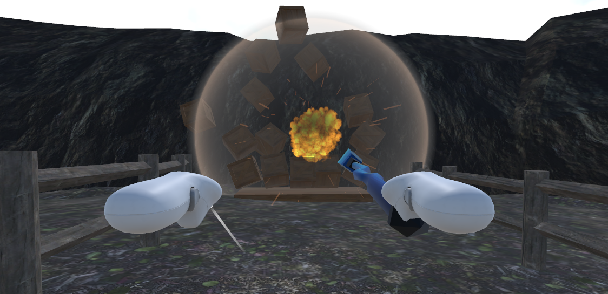

#  VR 1 Final Project

## Project Report

This is a magic sandbox game with a flexible spellcrafting system inspired by Noita.
Spells can be combined and arranged in unique ways to produce different results.

The main skill that I focused on in this project was programming, but I also learned a lot about
3D modeling and UV mapping with Blender. Most of the models in this game are made by me. While the models
themselves are fairly basic, I enjoyed making them and I have greater confidence in my abilities to create
models in the future.

The biggest challenge I faced during this project was the architecture of the spell system, specifically the organization of spell code.
I wanted to add many different spells to the game, so the system needed to be extensible and flexible.

I solved this problem by separating spell code into three categories:
1. Grouptime - code executes when the spell is added to a group
2. Casttime - code executes when the spell is cast
3. Runtime - code executes continuously while the spell exists

All spells have Grouptime code, but they may or may not have either of the other two.

These categories are handled by two class hierarchies:
1. SpellFactory - Contains Grouptime and Casttime spell code
2. Projectile - Contains Runtime spell code

SpellFactories are scriptable objects, so they can be assigned different parameters to produce different spells.
They're responsible for modifying the current spell group and instantiating prefabs associated with a spell.

The Projectile class, on the other hand, is a MonoBehaviour component that is attached to a prefab associated with a spell.
At Casttime, the projectile component is accessed and initialized by the corresponding SpellFactory.

Naturally, both the SpellFactory and Projectile classes are extended via inheritance for more specific use cases,
such as ProjectileFactory, which produces projectile spells.

## Screenshots

## Sources

### Materials

- https://freepbr.com/product/light-gold-pbr-metal-material/
- https://freepbr.com/product/rough-rockface-3-pbr-material/
- https://freepbr.com/product/forest-floor1/
- https://freepbr.com/product/dark-rough-rock1/
- https://polyhaven.com/a/farmland_overcast
- https://polyhaven.com/a/velour_velvet
- https://polyhaven.com/a/wood_table_worn
- https://freepbr.com/product/cloudy-veined-quartz/
- https://freepbr.com/product/obsidian-pbr-material/
- https://polyhaven.com/a/wood_planks
- https://polyhaven.com/a/rough_wood

### Unity Asset Store

- https://assetstore.unity.com/packages/p/magic-effects-free-247933
- https://assetstore.unity.com/packages/p/particle-pack-127325
- https://assetstore.unity.com/packages/3d/props/weapons/3d-items-free-wand-pack-46225
- https://assetstore.unity.com/packages/p/quick-outline-115488

### Models

- https://poly.pizza/m/vlVx279xut

### Audio

- https://niiiemand.itch.io/niiiemands-explosion-sfx
- https://lmglolo.itch.io/free-fps-sfx
- https://freesound.org/people/caileykehoe/sounds/444181/
- https://freesound.org/people/elliott.klein/sounds/189630/
